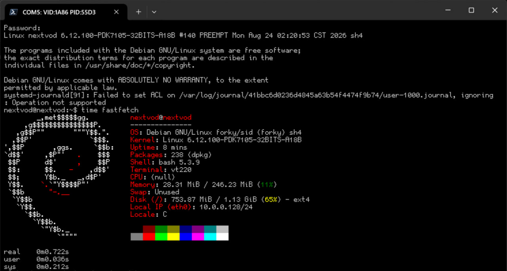

# Linux 6.12.100 NextVOD GB620 / STx7105 (PDK7105) patch series

> [!WARNING]
> 100% AI Slop ahead!
> 
> All these patches are written by DeepSeek-V4-Flash-0731.
> 
> Although I've tested on a real machine but I can not guarantee this will work for you.
> 
> Proceed with caution!

This series ports Linux 6.12.100 to the STMicroelectronics STx7105 (PDK7105)
SoC as used in the NextVOD GB620 (網樂通/网乐通) set-top box.

## Apply

From a pristine Linux 6.12.100 source tree:

```sh
for p in $(cat series); do
    patch -p1 < "$p"
done
```

or with git:

```sh
git am series
```

## Patch overview

| Patch | Area                                                           |
| ----- | -------------------------------------------------------------- |
| 0001  | arch/sh: ST40 CPU subtype / Kconfig / flags                    |
| 0002  | arch/sh: ILC3 interrupt controller driver                      |
| 0003  | arch/sh: STx7105 SoC setup (INTC, TMU)                         |
| 0004  | arch/sh: PDK7105 board base support                            |
| 0005  | arch/sh: ST40 PMB memory management                            |
| 0006  | serial: st-asc driver available on SuperH                      |
| 0007  | arch/sh: ST40 CPU identification and exception vector fix      |
| 0008  | arch/sh: ST40 cache/TLB/CPU init bring-up fixes                |
| 0009  | arch/sh: PDK7105 board USB/ethernet/PHY updates                |
| 0010  | arch/sh: STx7105 SoC/TMU clock fallback                        |
| 0011  | arch/sh: early ASC console PMB mapping and symbolic init stack |
| 0012  | arch/sh: ST40 PMB bring-up fixes                               |
| 0013  | serial: st-asc polling console support                         |
| 0014  | mm: avoid poisoning freed initmem on this port                 |

## Bootable image

See [here](https://legacy.kevinmx.top/Legacy/nextvod) for a bootable Debian forky/sid image.

Flash [sh4twbox](https://code.google.com/archive/p/sh4twbox/) U-Boot first. Then use an external USB drive to boot.

The default apt mirror is set to [MirrorZ](http://mirrors.cernet.edu.cn/), change it if you're outside Chinese mainland.

